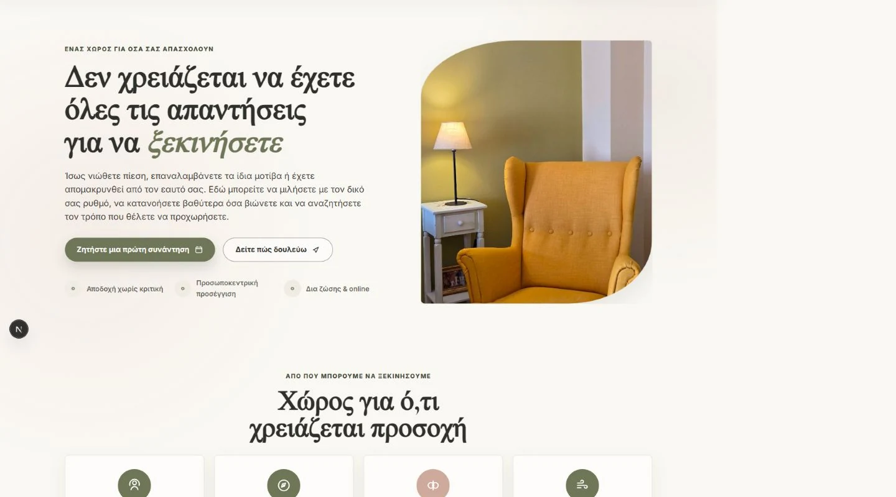
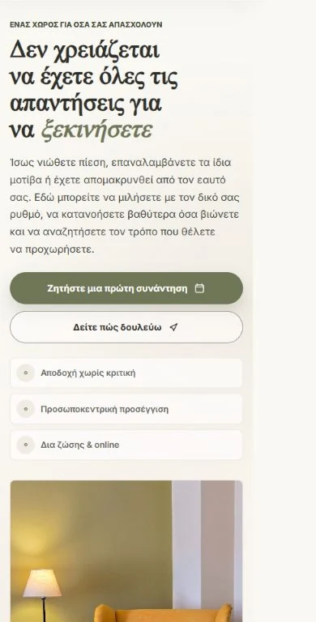

# Psychologist Website

A production website for a psychologist, rebuilt as a responsive Next.js application with structured content, articles, contact, and appointment options.

## Overview

The project reorganised an existing site into a maintainable Next.js codebase while preserving its established content and visual identity. It provides service information, long-form articles, contact options, and a route to online appointment booking.

## Live website

The deployment currently redirects to `talktoyourpsy.gr`, but the custom domain did not resolve during the final verification on 29 August 2026. A public link will be added after DNS is working reliably.

## My work

- Migrated the existing website to Next.js, TypeScript, and React
- Organised page content and reusable layout components
- Implemented responsive navigation and page interactions
- Built a validated contact flow with Resend email delivery
- Integrated Google Calendar appointment booking
- Added metadata, canonical URLs, Open Graph data, structured data, robots rules, and sitemap generation
- Added a repeatable SEO crawl check and production deployment configuration

## Features

- Service and approach pages
- Article library with individual article pages
- Contact form with validation, honeypot filtering, origin checks, request-size limits, and rate limiting
- Online and in-person session options
- Google Calendar booking integration
- Legacy URL redirects and responsive layouts

## Tech stack

Next.js · TypeScript · React · Tailwind CSS · Resend · Google Calendar · Vercel

## Screenshots

### Desktop

### Mobile

## Architecture

Next.js renders the public pages from structured content stored with the application. A server-side contact route validates submissions and sends email through Resend. Appointment booking is provided through a Google Calendar integration; there is no public database or administration interface in this project.

## Security and production considerations

- Email credentials stay in server-only environment variables
- Contact submissions are checked for allowed origin, content type, body size, field limits, and simple abuse signals
- Response headers include a focused Content Security Policy and common browser hardening headers
- API routes are excluded from indexing, and production browser source maps are disabled
- Screenshots in this case study avoid contact details and private information

## Source code

The production source code is maintained in a private repository. This repository is a public case study of the project.
